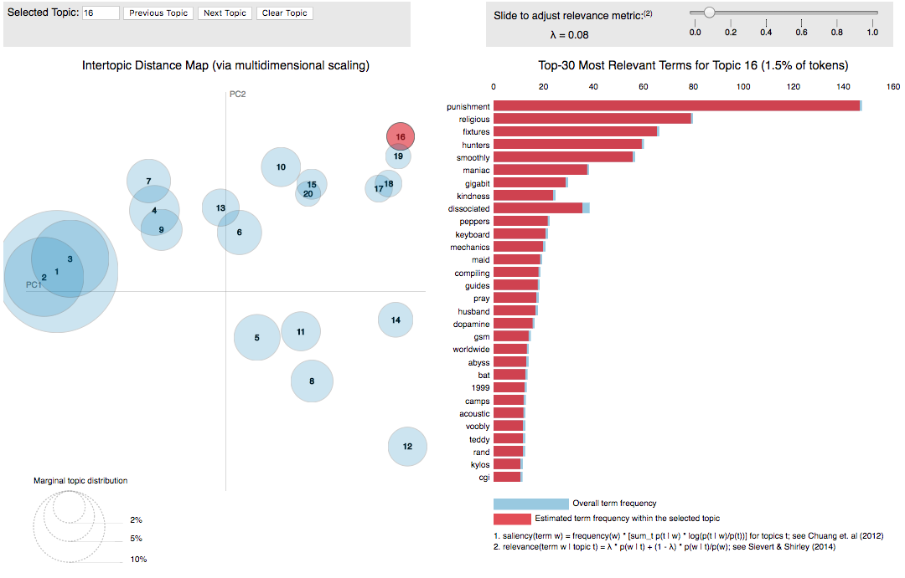

# Natural Language Processing - Unsupervised Topic Modeling with Reddit Posts

[Full Notebook - NLP-Reddit](NLP-Reddit.ipynb)  
[Results Visualization - pyLDAvis-shortcut](pyLDAvis-shortcut.ipynb)  
[Slides - TMReddit](TMReddit.pdf)

### Abstract:
In this project I took advantage of the Google Cloud Suite to analyze topics of Reddit users' self-posts resulting in segmented user groups. This could serve marketers and allow them to group people by interests based on their text data and use these segmentations to target advertising efforts. After trying various methods, I concluded with Latent Dirichlet Allocation to find meaningful topics.

### Data Acquisition/ Description/ Preprocessing:
Using the publicly available fh-bigquery reddit_posts dataset, I queried the June 2016 subset for all self-posts with at least 550 characters and a score of at least 8 to filter for good content while still retaining a good size of data. Some subreddits were filtered out due to duplicates, bad noise, foreign languages, and bot behavior. These were my initial biases to the data and my analyses and conclusions drawn are biased, they are not meant to be a representative view of all of Reddit and conclusions only pertain to the 147,000 posts I queried.

The columns returned: created_utc, subreddit, author, domain, url, num_comments, score, title, selftext, id, gilded, retrieved_on, over_18.

If I were to be able to further dig into the data, I would try to incorporate the post created date for temporal analysis. There is also tons more EDA that could be used to describe posts and users. I only used title and selftext columns to perform topic modeling.

During cleaning I removed links, html character entities (i.e. `&amp;`), newline breaks, punctuation, and put all characters in lowercase.

Using nltk's english stopwords, I tokenized the posts with words greater than or equal to 3 characters, took a max term frequency across documents of 30% and used a minimum term frequency occurring in at least 1 of 10,000 documents. I did not use n-grams but would like to if I had the computational resources. I explain the tf-idf settings in the notebook but do not use them for modeling. I ended up with 47,317 terms in the 147,000 documents.

### Analyses:
I first looked at Singular Value Decomposition as a means of reducing the dimensionality and found the count vectorizer explaining much more variance via the explained_variance_ratio_ function from sklearn's TruncatedSVD. 5 or 10 components seemed to be the best elbows from the plot of explained variance with around 10+% for cv versus tf-idf's 1-2%.

After applying the SVD with gensim's LSI model, I tried using similarity scoring metrics and running KMeans for clustering but did not find meaningful results. I focused my efforts on getting Latent Dirichlet Allocation working,  which did provide actionable insights.

I ran an unsupervised LDA model on 15 topics for 100 passes getting down to a topic diff of 0.010591. I fed this into pyLDAvis to understand the topics. The descriptions at 1.0 lambda relevance, which weighs the frequency of words as they appear within a topic and globally, are much different from 0.1 lambda and provide a new story for each topic. In a low lambda setting, unfrequent words are given more importance. I wont post the results from 0.1 lambda because it would be slightly redundant and they contain some explicit material, but will post the underlying theme under *L.1* in parallel with each topic and I encourage everyone to try out my pyLDAvis notebook to check them out. Relevance was explained by this [paper](https://nlp.stanford.edu/events/illvi2014/papers/sievert-illvi2014.pdf) as `relevance(term w | topic t) = λ * p(w | t) + (1 - λ) * p(w | t)/p(w)`

Actual results of the LDA model are right after the conclusion.

### Conclusion:
Using Natural Language Processing methods, I was able to train a Latent Dirichlet model successfully and learned something about Reddit posts from June 2016! The model can assign a probability distribution to each document. Rolling up each document by user could create a user profile and create segments of users for advertising purposes. Instead of focusing on certain subreddits, marketers could target user's digital id that would allow them to find users in different channels and platforms or focus on certain posts. Since we have keywords associated to each topic and user, we can search users that relate to certain keywords or topics using probabilities as thresholds. For example, a text post about gaming was assigned a topic distribution of [(Health, 2.3%), (Gaming, 88.8%), (Sports, 8.1%)]. Marketers could include this in a segment for Gaming posts with probabilities greater than 85% and buy the advertising on that post, or the documents can be rolled up by author and we could find other similar users that fall into the Gaming topic area with greater than 85% probability and call the group "Hardcore Gamers >85%".

With further effort, I could observe more specific subreddits or users and look at sentiment analysis, similarity metrics, and add a temporal aspect to the analysis to view things as they change over time. N-grams could increase the semantic value in documents to extract deeper information, but would require more parallelized computing. A good next step could also be implementing a flask app for building segments of users with these 15 topics to show how many users would fall into a certain bucket given adjustments to the topic probabilities.

### Results:

Here are the top 30 words for the learned topics from Latent Dirichlet Allocation:

*Label (Topic #, Tokens%): Top Words Contributing to Topics*  
*L.1: Hidden Topic*

Spanish Stopwords (0, 1%):
 - que, los, con, por, las, para, del, una, como, podemos, pol, pero, psoe, sus, este, nos, espa, porque, todo, tica, esta
 - L.1: Spanish Stopwords

Health Products / Food (1, 5%):
 - cream, oil, water, food, use, make, much, used, well, skin, first, good, eat, two, new, ship, using, made, small, light, space, little, great, think, need, bit, pretty, red, weight, something
 - L.1: Food/ Diet

Gaming/ Internet (2, 9.9%):
 - game, games, xbox, gameplay, play, dlc, playing, console, controller, screen, demo, linux, ps4, files, vive, nintendo, developers, settings, device, install, devs, system, multiplayer, zelda, oculus, dev, servers, mode, steam, bass
 - L.1: Gaming/ Technology

Empathy/ Social (3, 19.3%):
 - want, feel, think, going, never, life, things, much, day, got, years, said, something, cant, friends, good, told, still, love, say, back, make, way, always, family, first, see, well, since
 - L.1: Family, Mental Issues

Politics/ Culture/ Global (4, 7%):
 - government, world, women, men, believe, may, war, think, country, state, way, church, make, say, right, white, american, see, states, however, human, fact, history, must, change, power, system, god, control, political
 - L.1: Global (Politics)/ Religion

Social/ Storytelling (5, 12.5%):
 - back, around, said, got, room, went, night, door, see, little, right, still, head, started, going, first, day, took, way, looked, away, came, left, two, face, something, hand, house, look, felt
 - L.1: NSFW! Erotic Writing

Books/ Music (6, 2.8%):
 - chapter, world, song, music, table, album, links, previous, synopsis, life, source, contents, songs, new, raw, translated, search, post, man, day, novel, announcement, years, discussion, story, john, band, updates, martial, author
 - L.1: /r/noveltranslations, Random

Gaming/ Sports (7, 3.1%):  
 - tournament, logo, team, match, teams, league, matches, game, players, win, games, season, round, play, player, 2016, week, top, winner, points, best, event, map, group, played, last, stream, gaming, day, first
 - L.1: eSports, League of Legends

Career (8, 7.8%):
 - company, money, work, year, job, years, need, pay, new, back, going, day, take, car, help, make, want, working, month, well, two, first, got, much, week, since, school, days, last, months
 - L.1: Financials/ Career

Biblical/ War (9, 6.1%):
 - man, death, lord, back, first, see, king, think, dead, world, way, two, well, battle, men, war, dark, father, fight, still, god, kill, everything, killed, life, made, end, come, never, name
 - L.1: Game of Thrones

Entertainment (10, 2.8%):  
 - episode, think, show, season, character, trump, see, vote, story, characters, first, series, book, movie, much, good, going, well, thats, bernie, way, make, something, hillary, read, great, hes, love, episodes, want
 - L.1: Democrats/ Election

Trading (11, 2.4%):
 - card, price, windows, shipping, purchase, amazon, pokemon, cpu, buy, box, key, sale, gift, item, case, pro, items, cards, power, 100, giveaway, pay, build, bitcoin, available, 2016, pack, keys, stock, new
 - L.1: Computer Rigs, Bitcoin

Sports (12, 3.7%):
 - scores, ball, score, game, icon, bar, line, field, center, fielder, spacer, rbi, sprite6, 2016, goal, left, era, fly, drive, 2nd, right, season, year, run, first, team, big, top, play, two
 - L.1: Sports

Reddit-Meta/ Community (13, 6.5%):
 - thread, link, posts, subreddit, comment, post, please, new, questions, want, help, reddit, free, community, edit, week, comments, see, make, may, june, discussion, use, rules, sub, everyone, check, information, page, ask
 - L.1: Theads/ (Meta)

Gaming (Card/ MMORPG) (14, 7.9%):
 - damage, deck, weapon, enemy, armor, level, use, game, attack, good, hit, make, hero, kill, skill, speed, weapons, much, team, play, card, ability, players, turn, fire, high, first, take,  range, cards
 - L.1: Hearthstone, League of Legends
